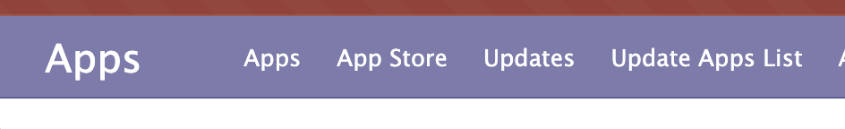
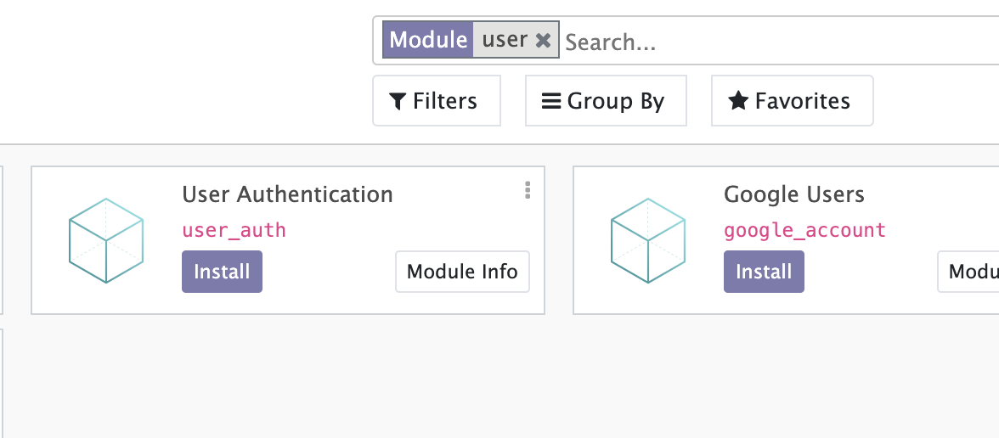
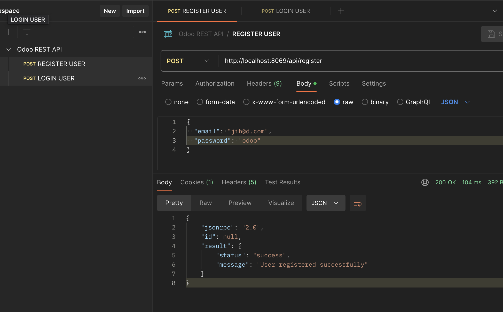
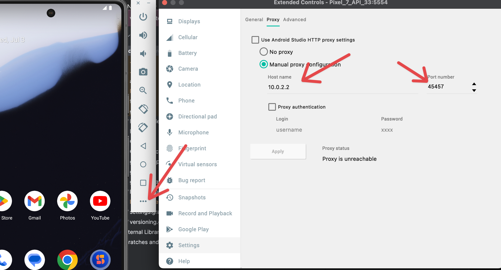

# Tugas ERP Pemrograman Mobile

Membuat aplikasi mobile dengan fitur login dan register, serta login dan register api dengan odoo dan postgres db yang di serve di docker, juga pgadmin untuk mengecek isi db.

1. Install docker, lalu pull image postgres:14, odoo:14, juga dpage/pgadmin4.
    - Cara 1: Ikuti [tutorial dari dosen](https://github.com/maztarigan/bootcamp)<br />
        Note: untuk mac, ganti command untuk instalasi odoo menjadi
        ```
        docker run -p 8069:8069  -d --platform linux/x86_64/v8 --name  erp14 --link dberp14:db -t odoo:14
        ```
    - Cara 2: Menggunakan `docker-compose.yml` yang sudah ada lalu jalankan command 
        ```
        docker-compose up -d 
        ```
        Note: untuk windows, buka `docker-compose.yml` terlebih dahulu dan hapus baris 17 yang berisi
        ```
        platform: linux/x86_64/v8
        ```

2. Setelah odoo berhasil dijalankan, buka `localhost:8069` > Settings > scroll ke paling bawah > Activate the developer mode.

3. Buka menu Apps, lalu Update Apps List.<br />
    

4. Install custom module yang sudah dibuat. Di repo ini custom module yang telah saya buat adalah [User Authentication](./custom_addons/user_auth) dengan tag `user_auth`.<br />
    

5. Test custom module odoo yang sudah berbentuk api di postman, jangan lupa kirim dalam raw dan berbentuk json.<br />
     

6. Api sudah bisa diakses melalui postman, tetapi tidak bisa melalui flutter di emulator. Ubah `localhost:8069` menjadi `http://10.0.2.2:8069`. Juga ubah proxy di emulator menjadi 
    ```
    host name: 10.0.2.2
    port: 45457
    ```
    

7. Jalankan code flutter dan cek fitur login dan register yang sudah diimplementasikan di [source code](./erp_mobile).